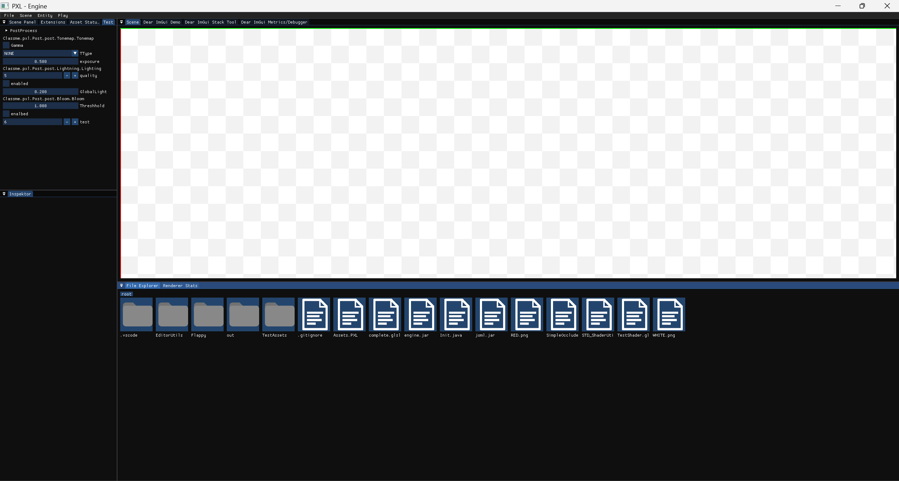
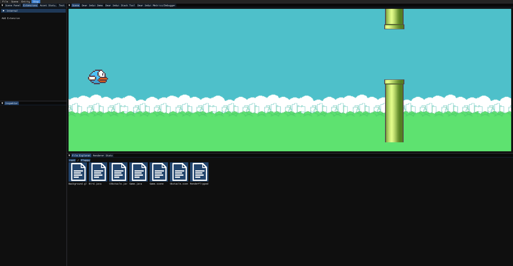
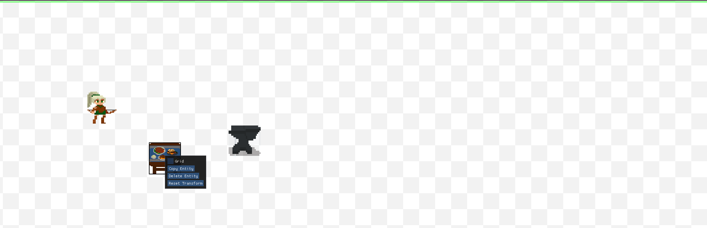

# PXL Engine

PXL is a 2D game engine written in Java. It provides an editor for creating and managing game scenes and assets.

## Screenshots

### Main View


### Play in Editor


### Selecting an Entity


## Features

*   **2D Rendering:** Optimized for 2D pixel art games.
*   **Scene Editor:** A built-in editor to create and manipulate game scenes.
*   **Physics:** Integrated with JBox2D for 2D physics simulation.
*   **UI:** Uses ImGui for the editor's user interface.
*   **Scripting:** Use Java to script game logic.
*   **Asset Management:** Simple asset management for sprites, scenes, and scripts.

## Getting Started

To build the project, you will need to have a JDK installed. Then you can use the provided Gradle wrapper to build the engine and the editor.

```bash
./gradlew build
```

To run the editor:

```bash
./gradlew :Editor:run
```

## Demo

The `demo` directory contains a sample project, a Flappy Bird clone, to demonstrate the engine's capabilities.
